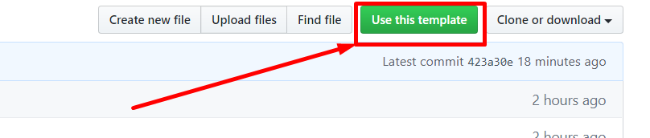

# flutter_architecture_template


## Getting Started


```bash
$ pub pub get
```

## Rename Organizer

```bash
$ pub global active rename
$ pub global run rename --bundleId com.test.newName
$ pub global run rename --appname "Network Upp"
```


## Meta

Muhammed OKUR – [@linkedin](https://www.linkedin.com/in/muhammed-okur-035b06111/) – muhammedokur@yaani.com

Distributed under the MIT license. See ``LICENSE`` for more information.

[https://github.com/okursoftware](https://github.com/okursoftware/)